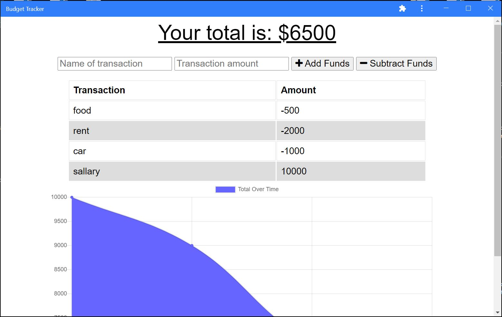

# Budget Tracker 
  

  ## Description

  Budget Tracker is an application that helps you tracking your withdrawals and deposits with or without a data/internet connection SO THAT your account balance is accurate when you are traveling 
  
  ## Table of Contents

  * [Installation](#installation)
  * [Usage](#usage)
  * [Contributing](#contributing)
  * [Tests](#tests)
  * [Questions](#questions)
  * [License](#license)

  ## Installation

    Deployed Application: https://protected-woodland-36311.herokuapp.com/
  

  ## Usage

GIVEN a budget tracker without an internet connection

WHEN the user inputs an expense or deposit

THEN they will receive a notification that they have added an expense or deposit

WHEN the user reestablishes an internet connection

THEN the deposits or expenses added while they were offline are added to their transaction history and their totals are updated
Mock-Up

  Deployed Application: https://rocky-retreat-60179.herokuapp.com/

  Github Reprository: https://github.com/raedaltaki/Budget-Tracker
  

  ## Contributing

  https://courses.bootcampspot.com/

 https://github.com/coding-boot-camp/symmetrical-bassoon
  

  ## Tests

  Deployed Application: https://rocky-retreat-60179.herokuapp.com/
  

  ## Questions

  For addition questions, Please reach me at:

  GITHUB: https://github.com/raedaltaki
  
  Email: raed.simon@gmail.com

  ## License
  
  https://choosealicense.com/licenses/mit/

  
      MIT License

      Copyright (c) 2021 raedaltaki
      
      Permission is hereby granted, free of charge, to any person obtaining a copy
      of this software and associated documentation files (the "Software"), to deal
      in the Software without restriction, including without limitation the rights
      to use, copy, modify, merge, publish, distribute, sublicense, and/or sell
      copies of the Software, and to permit persons to whom the Software is
      furnished to do so, subject to the following conditions:
      
      The above copyright notice and this permission notice shall be included in all
      copies or substantial portions of the Software.
      
      THE SOFTWARE IS PROVIDED "AS IS", WITHOUT WARRANTY OF ANY KIND, EXPRESS OR
      IMPLIED, INCLUDING BUT NOT LIMITED TO THE WARRANTIES OF MERCHANTABILITY,
      FITNESS FOR A PARTICULAR PURPOSE AND NONINFRINGEMENT. IN NO EVENT SHALL THE
      AUTHORS OR COPYRIGHT HOLDERS BE LIABLE FOR ANY CLAIM, DAMAGES OR OTHER
      LIABILITY, WHETHER IN AN ACTION OF CONTRACT, TORT OR OTHERWISE, ARISING FROM,
      OUT OF OR IN CONNECTION WITH THE SOFTWARE OR THE USE OR OTHER DEALINGS IN THE
      SOFTWARE.
      

  